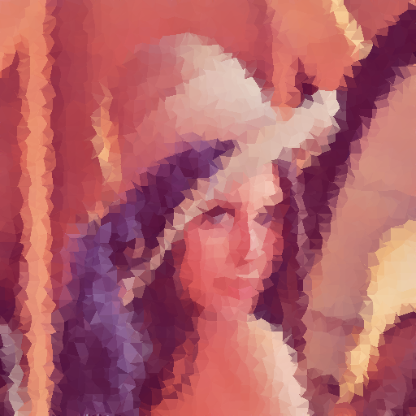

# Low Poly Project

This is a basic implementation of transforming files to the low poly artstyle. Randomly selects points (one point chosen per square of size `(xPeriod, yPeriod)`) in the picture and creates triangles to create the artwork.

This simple process actually yieds half decent results! You can see these below.

### Original Image

### Period of 10 Pixels

### Period of 20 Pixels

### Period of 30 Pixels

